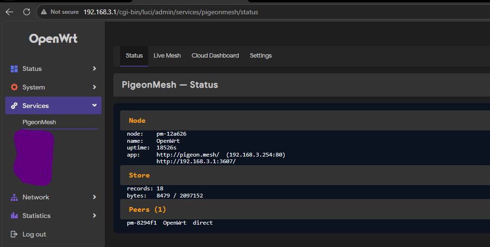

<p align="center">
  
</p>

# PigeonMesh

**Communication that survives a shutdown.**

PigeonMesh turns ordinary OpenWrt routers into a communication network that
keeps working when the internet does not. Routers find each other over the LAN
and replicate a log of signed records: chat, emergency alerts, "I am safe"
check-ins, missing-person reports and relief map pins.

Phones join by opening a web page. No app, no account, no sign-up. And any
phone that walks between two parts of the mesh that cannot see each other
carries records across in someone's pocket, so islands converge without a link
between them. That is the pigeon in PigeonMesh.

Built for **Track A — Crisis Tech**, in the spirit of Jogajog, the mesh that
kept people connected during the internet shutdowns of the July Revolution.

---

## The five-minute version

A flood cuts a district in half. The mobile towers go dark. People are stranded
on rooftops. In the old world, they wait.

Here, a volunteer has already installed PigeonMesh on three home routers in the
area. People connect to the Wi-Fi, open `http://pigeon.mesh/`, and they are on
the mesh. Chat works. Check-ins work. An SOS reaches every phone on every node
in under a second.

Two of those routers cannot see each other — the flood is between them. Someone
who opens the app on one side and later walks to the other carries every record
across the gap. The mesh does not notice the gap; it reconciles when that person
walks back into range.

A float switch on a GPIO pin at the embankment raises an SOS the moment water
crosses it, with no human in the loop. A coordinator in another city with the
cloud bridge open in a browser sees it the instant any router in the mesh gets
an uplink.

Bill of materials per village: three home routers, one ESP32 with sensors, and
a volunteer's existing phone. The only internet dependency is the
coordinator's, not the field's.

---

## What is in this repository

| Directory | What it is |
|---|---|
| [`openwrt-package-source/`](openwrt-package-source/) | The router package. Lua, shell and static assets — no compilation, one build runs on every architecture. This is the core of the project. |
| [`pigeonmesh-bridge/`](pigeonmesh-bridge/) | Next.js coordinator dashboard, deployable to Vercel. Acts as another mesh peer over HTTP, plus a live feed for people outside the mesh. |
| [`pigeonmesh-esp32/`](pigeonmesh-esp32/) | Arduino firmware for ESP32 / NodeMCU. Float switch raises an SOS; a mesh SOS sounds a local alarm. |
| [`install-on-router.sh`](install-on-router.sh) | Optional helper that points an installed node at a cloud bridge URL. |

Build outputs land in `dist/`, which is not committed — see
[Building](#building) below.

---

## How the addressing works

Two names, two different things, both on port 80. This is the part that most
often gets set up wrong, so it is worth being precise.

```
http://pigeon.mesh/       ->  PigeonMesh, the app people use
http://192.168.3.1/       ->  LuCI, the router admin interface
http://192.168.3.1:3607/  ->  PigeonMesh, direct, always available
```

The router keeps its own address for LuCI. On install, PigeonMesh claims a
**second LAN address** for itself — `.254` in your LAN subnet by default —
`pigeon.mesh` resolves there, and one firewall rule rewrites port 80 on that
address to 3607:

```
ip daddr <alias> tcp dport 80 redirect to :3607
```

So the browser keeps showing `http://pigeon.mesh/` with no port, and the app
answers. Only traffic addressed to PigeonMesh's own address is touched; the
router's address on port 80 is never matched.

It works this way rather than by listening on port 80 directly because uhttpd
holds the wildcard `0.0.0.0:80` and the kernel refuses a second bind for a
specific address on the same port. The alternative would be narrowing uhttpd's
listen addresses, and an admin who later changed the LAN address would lose
LuCI. **Nothing here reconfigures uhttpd**, so this cannot lock anyone out.

If the second address cannot be created, the app is still on 3607 on every
address and everything except the short URL behaves as before.

Earlier releases did this with a JavaScript redirect in `/www/index.html` that
sniffed the `Host` header and bounced to `:3607`. That is gone; installing
1.1.0 puts the stock LuCI index page back.

If you have deliberately narrowed uhttpd yourself and would rather bind port 80
directly, set `alias_listen 1` in `/etc/config/pigeonmesh`.

### Ports

| Port | Where | What |
|---|---|---|
| 80 | PigeonMesh's own LAN address | Redirected to 3607 — `http://pigeon.mesh/` |
| 80 | the router's LAN address | uhttpd, LuCI (untouched by this package) |
| 3607 | every address | The app and its API, direct |
| 7100 | every address | Router-to-router mesh link (TCP) |
| 7101 | every address | Discovery beacons (UDP broadcast) |

All of it is LAN-only. Nothing opens a port to the WAN: a node reachable from
the internet is a node an adversary can enumerate.

---

## Installing on a router

Requires OpenWrt with Lua 5.1 and nixio (`luci-lib-nixio`), which any router
running LuCI already has. Around 270 KB installed.

Note on the word "apk": OpenWrt 24.10+ uses `apk` as its package manager, so
the router package file is named `.apk`. It has nothing to do with Android.

```bash
# OpenWrt 24.10 and newer (apk)
scp dist/pigeonmesh-1.1.0-r1.apk root@192.168.3.1:/tmp/
ssh root@192.168.3.1 'apk add --allow-untrusted /tmp/pigeonmesh-1.1.0-r1.apk'
```

```bash
# OpenWrt 23.05 and older (opkg)
scp dist/pigeonmesh_1.1.0-r1_all.ipk root@192.168.3.1:/tmp/
ssh root@192.168.3.1 'opkg install /tmp/pigeonmesh_1.1.0-r1_all.ipk'
```

Installing does all of this by itself — there is no second script to run:

1. Starts `pigeonmeshd` and enables it at boot.
2. Adds PigeonMesh's LAN address and puts it in the `lan` firewall zone.
3. Points `pigeon.mesh` at that address in dnsmasq and `/etc/hosts`.
4. Opens 7100, 7101 and 3607 to the LAN only, and adds the port-80 redirect.
5. Adds **Services → PigeonMesh** to LuCI.

Uninstalling (`apk del pigeonmesh`) undoes every one of those.

Then tell people: **connect to the Wi-Fi, open `http://pigeon.mesh/`**.

---

## Adding a second router

Two routers within Wi-Fi range of each other discover one another
automatically over UDP broadcast on 7101. Nothing to configure.

Two routers out of broadcast range — a directional link, a VPN, a different
subnet — get linked by hand:

```bash
# on router B, which has joined router A's network
pigeonmesh link 192.168.3.1
pigeonmesh status
```

If there is no link at all, people carry the records. That needs no
configuration, which is the point.

### Router CLI

```
pigeonmesh status              node health, peers, storage
pigeonmesh peers               every node the mesh knows about
pigeonmesh tail [n]            last n records
pigeonmesh watch               follow records live
pigeonmesh send <text>         post a chat message from this node
pigeonmesh sos <text>          post a priority alert (for sensors and scripts)
pigeonmesh bulletin <text>     post an announcement
pigeonmesh link <ip[:port]>    keep a link discovery cannot find
pigeonmesh unlink <ip[:port]>  drop that link
pigeonmesh domain [name]       re-point pigeon.mesh at this router
pigeonmesh wipe CONFIRM        erase every record held by this node
```

`pigeonmesh sos` exists so a sensor or a cron job can raise an alert. Records
posted this way are unsigned on purpose: the router cannot prove who typed the
command, only which node it came from, and the app labels them accordingly.

---

## The app

Dark by default, Bangla by default, built for a phone held in one hand at night
by someone who is frightened. Touch targets are never smaller than 44 px, there
are no web fonts to fail to load, and the whole thing is about 110 KB.

<p align="center">
  
  
  
</p>
<p align="center">
  
  
</p>

- **Chat** — public, relief and medical channels.
- **SOS** — hold to send, so a pocket press cannot fire it. What is happening,
  what you need, and your location if you allow it.
- **People** — "I am safe" check-ins and missing-person reports with a
  downscaled photo (~4 KB, so it crosses a shared 2 Mbit hop).
- **Map** — real OpenStreetMap tiles when the device has any internet, cached
  in IndexedDB so an area looked at once stays visible after the data stops.
  **Save this area** downloads the surrounding tiles deliberately, which is
  what to do before walking somewhere with no signal. With no tiles at all it
  falls back to a metric grid with a scale bar. Pins for shelters, water,
  medical, food, danger, blocked roads and boats.
- **Mesh** — node health, peers, your identity fingerprint, and a panic wipe.

Language is a toggle in the top bar and switches everything, including
numerals and units.

Every record is signed on the device with Ed25519 and direct messages are
encrypted end to end. A seized router yields the public bulletin board and
nothing else — no identities to forge, no private messages to read.

### Location on a mesh node

Browsers refuse geolocation outside a secure context, and a node on plain
`http://` is exactly that. There is no certificate authority to reach when the
internet is down. So on a real deployment the app cannot read GPS, and it says
so plainly rather than reporting a GPS failure. Tap the map to choose a spot
instead — that path never depends on the browser granting anything.

---

## LuCI

**Services → PigeonMesh**, once LuCI is installed:

<p align="center">
  
</p>

| Page | What |
|---|---|
| Status | Live node info, peers, store usage |
| Live Mesh | The whole app in a frame |
| Cloud Dashboard | The configured bridge, if there is one |
| Settings | Ports, PigeonMesh's address, bridge URL |

These pages are English only. They are an admin surface, and the people using
them are reading OpenWrt's own English interface around them.

---

## Cloud bridge

Optional. The mesh does not need it. It exists so a coordinator outside the
disaster area can see what is happening, and so two meshes that both get an
uplink converge with each other.

```bash
cd pigeonmesh-bridge
bun install
bun run dev            # http://localhost:3000
```

Deploy it to Vercel, then point a node at it:

```bash
ssh root@192.168.3.1 'sh /tmp/install-on-router.sh https://your-app.vercel.app'
```

or set it under **Services → PigeonMesh → Settings**. An empty URL disables
bridging, which is the default — nothing leaves the LAN unless you ask it to.

The bridge serves the same app the router does, at `/pwa/`. There is one source
of truth for those files; `./sync-pwa.sh` copies them across and
`./sync-pwa.sh --check` fails if they have drifted.

---

## ESP32 sensor node

Firmware in [`pigeonmesh-esp32/`](pigeonmesh-esp32/). A float switch raises an
SOS the moment water crosses it; an SOS from anywhere in the mesh sounds the
local buzzer.

### Bill of materials

| Component | Approx. cost (₹) |
|---|---|
| ESP32 DevKit v1 (38-pin) | 350 |
| Float switch, normally closed, marine | 120 |
| Active buzzer 3.3 V | 25 |
| LED + 220 Ω resistor | 10 |
| 18650 cell 2200 mAh + holder | 80 |
| TP4056 charger module | 25 |
| 5 W 5 V solar panel (optional) | 100 |
| IP65 junction box | 60 |
| **Total** | **~770** (~670 without solar) |

### Pin map

```
 ESP32 pin        Component                 Notes
 ───────────      ─────────────────         ──────────────────────────────
 3V3  ─────────   float switch (NC) ──┐     internal pull-up on GPIO4
 GPIO4 ────────   float switch ───────┘     active LOW = water present
 GPIO0 (BOOT) ─   panic button              hold 3 s = manual SOS (optional)
 GPIO2 ────────   LED anode + 220 Ω → GND   onboard LED on DevKit v1
 GPIO15 ───────   buzzer + → GND            active buzzer, 3.3 V
 GPIO34 (ADC1) ─  18650 divider midpoint    100 kΩ to 18650 +, 100 kΩ to GND
```

### Weatherproofing

Put the ESP32 and cell in the IP65 box. One hole for the float-switch cable,
one for the buzzer so it can be heard, silicone around both. Mount the float
switch at the water level you want to alarm on, inside a PVC stilling tube so
wave action does not trigger it.

---

## Building

No SDK needed. The package is Lua, shell and static assets, so one build is
valid for every target architecture.

```bash
./openwrt-package-source/build/build.sh
```

That writes three files to `dist/`:

| File | For |
|---|---|
| `pigeonmesh-1.1.0-r1.apk` | OpenWrt 24.10+ (apk-tools 3) |
| `pigeonmesh_1.1.0-r1_all.ipk` | OpenWrt 23.05 and older (opkg) |
| `pigeonmesh-1.1.0-r1.tar.gz` | Plain tree, for hand installs and inspection |

The tarball and the `.ipk` build anywhere with `tar`, `gzip` and `ar`. The
`.apk` needs `apk mkpkg` from apk-tools 3, which ships in the OpenWrt SDK and
on Alpine but is not in the router's own build. Point `APK_BIN` at one:

```bash
APK_BIN=/path/to/apk ./openwrt-package-source/build/build.sh
```

Without it the other two are still produced and the `.apk` is skipped with a
note. Run under `fakeroot` if it is installed — the script re-executes itself
under it automatically — so package contents are owned by root rather than by
whoever built them.

### Through the OpenWrt buildroot

To have the official buildroot compile and sign it, or to bake it into a
firmware image:

```bash
echo "src-link pigeonmesh /path/to/openwrt-package-source/openwrt-feed" >> feeds.conf
./scripts/feeds update pigeonmesh && ./scripts/feeds install pigeonmesh
make menuconfig      # Network -> Communication -> pigeonmesh
make package/pigeonmesh/compile
```

---

## Field notes

**Before you go.** Install and test every router at base, not in the field.
Check `pigeonmesh status` on each. Confirm `http://pigeon.mesh/` opens on a
phone that has never seen the network before. Open the map at base and use
**Save this area** for the area you are going to — tiles cannot be fetched once
you are out of signal. Charge everything; a router needs power, not internet.

**Setting up.** One router is enough to be useful. Put the second where its
Wi-Fi overlaps the first, and they will find each other. Write
`pigeon.mesh` on a wall where people can read it.

**Running.** Watch `pigeonmesh watch` on a laptop if you have one. Storage is
capped (2 MB, ~4000 records by default) and the oldest records are evicted
first, so a long deployment will not fill the flash.

**Afterwards.** `pigeonmesh wipe CONFIRM` erases every record on a node. It
does not erase the mesh: other nodes keep their copies, and any phone that has
been carrying records will hand them back the next time it connects. To remove
something from the mesh you must wipe every node and every phone holding it.
The app's panic wipe is the same promise for one phone.

---

## Troubleshooting

**`http://pigeon.mesh/` does not open.**
Check the phone is using the router for DNS — some phones with Private DNS or a
VPN turned on will not resolve a local name at all. Turn those off, or use
`http://<router-ip>:3607/`. On the router, `nslookup pigeon.mesh 127.0.0.1`
should return PigeonMesh's address, and `uci get pigeonmesh.main.alias_ip`
should be set. `pigeonmesh domain` re-applies the DNS entry.

**`http://pigeon.mesh/` opens LuCI instead of the app.**
The name is pointing at the router's own address rather than PigeonMesh's. Run
`pigeonmesh domain`. If `uci get pigeonmesh.main.alias_ip` is empty, the second
address was never created — the app is on `:3607` and the short URL cannot work
until it is. Check the redirect exists with
`nft list table inet fw4 | grep 'friendly URL'`.

**The router IP opens the app instead of LuCI.**
An old install left its redirect in `/www/index.html`. Reinstalling 1.1.0
replaces it; or delete the file and reinstall `luci-base`.

**`pigeonmesh status` shows 0 peers.**
Both routers must be on the same layer-2 network for discovery to work. Check
7101/UDP is open on both and that neither is on a guest/isolated SSID. Failing
that, link them by hand with `pigeonmesh link`.

**Records are not moving between two routers.**
They may have no path at all, which is expected and not a fault. Records will
still cross on a phone that visits both. Check `pigeonmesh peers` on each.

**The map is blank or shows a grid instead of streets.**
No tiles are cached for that area and the device has no internet. Get any
connection, open the area, and use **Save this area**. The grid is the honest
fallback, not a failure.

**The app cannot get your location.**
Expected on `http://`. See [Location on a mesh node](#location-on-a-mesh-node).
Tap the map instead.

**The daemon is not running.**
`logread | grep pigeonmesh` shows why. `/etc/init.d/pigeonmesh restart`
restarts it; procd brings it back automatically if it crashes, because a
crashed node in a disaster is worse than a slow one.

---

## Licence

GPL-2.0-only. The Ed25519, X25519 and ChaCha20 implementations in the app are
clean-room ports of the published RFCs.

---

## Port 3607

**36 July = 5 August.** The day of the 2024 uprising.

> যোগাযোগ — the thing a crisis takes first, and the thing a crisis needs most.
